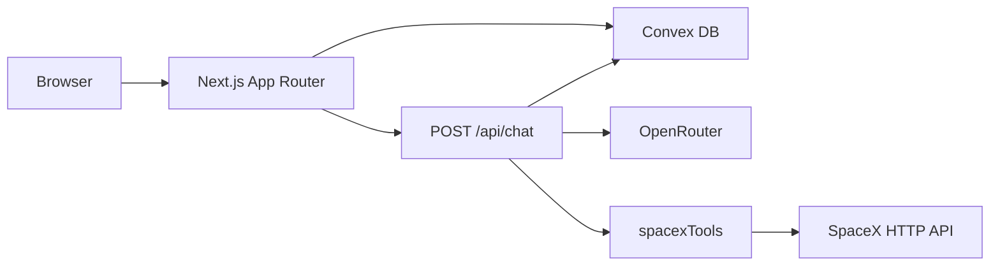
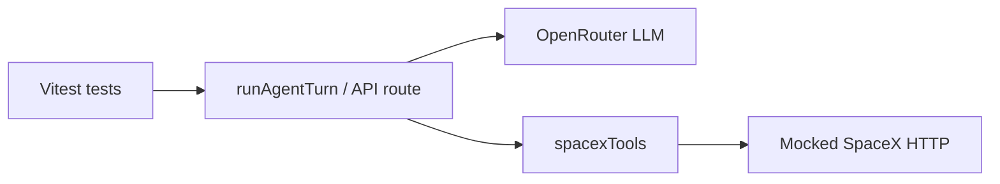

# spacex-agent

**Try it:** [spacex-agent.vercel.app](https://spacex-agent.vercel.app/) — Convex and related backend settings are **already configured** for that deployment; you do not need your own Convex account to use the site.

## Overview

**spacex-agent** is a SpaceX-focused chat assistant for people who want launch schedules, vehicles, pads, and catalog facts grounded in the public r/SpaceX dataset. The UI is a Next.js app: conversations live in **Convex**, replies stream from an LLM via **OpenRouter**, and the model can call **SpaceX HTTP tools** (default API base `https://api.spacexdata.com`). The system prompt pushes the model to use tools for catalog facts, ask clarifying questions when the subject is ambiguous, report lookup failures plainly, and refuse unrelated chaff without calling SpaceX tools.

The home route creates a Convex conversation and sends the user to `/chat/[id]` (`app/(chat)/page.tsx`).

## Architecture




- **Client:** React via Next.js App Router. When `NEXT_PUBLIC_CONVEX_URL` is set, `[app/ConvexClientProvider.tsx](app/ConvexClientProvider.tsx)` wraps the tree with `ConvexProvider` and `ConvexReactClient` for live queries and mutations (sidebar, thread list, chat).
- **Persistence:** Convex tables `[conversations](convex/schema.ts)` and `[messages](convex/schema.ts)`—per-thread metadata and ordered chat text.
- **Chat API:** `[app/api/chat/route.ts](app/api/chat/route.ts)` loads the conversation and prior messages from Convex, persists the new user message, runs `streamText` with OpenRouter and `spacexTools`, streams the UI message response, then saves the assistant text on `onFinish`.
- **External data:** Tool implementations call `[lib/spacex/client.ts](lib/spacex/client.ts)` against a configurable base URL (`[lib/spacex/config.ts](lib/spacex/config.ts)`; override with `SPACEX_API_BASE_URL`).

## Local development

### Prerequisites

- [Bun](https://bun.sh) — this repo uses `packageManager: bun@1.3.4` in `package.json`. Use `bun install` and `bun run <script>`. If other lockfiles appear in the tree, prefer Bun as specified here.
- A [Convex](https://convex.dev) deployment URL for **local** runs (see below—you can reuse the demo’s or create your own).
- An [OpenRouter](https://openrouter.ai) API key for the chat API (see below).

### Getting an OpenRouter API key

1. Open **[openrouter.ai](https://openrouter.ai)** and **sign up** or **sign in** (you can use GitHub, Google, or email).
2. Go to **[Keys](https://openrouter.ai/keys)** (from the dashboard: **API keys** / **Keys**).
3. Click **Create API key**, give it a label if prompted, then **copy the key** once it is shown. Keys usually look like `sk-or-v1-...`.
4. Paste it into `.env.local` as `OPENROUTER_API_KEY` (see [Environment variables](#environment-variables)). Do not commit it; `.env`* is gitignored.

OpenRouter bills **by usage** across models; add a payment method or credits in their billing settings if your account requires it. The default chat model is set in code (`[lib/ai/openrouter.ts](lib/ai/openrouter.ts)`); override with `OPENROUTER_MODEL` if you want a different model on OpenRouter.

### Convex: use the provided deployment or create your own

To run this repo **locally**, set `NEXT_PUBLIC_CONVEX_URL` in `.env.local` (see [Environment variables](#environment-variables)).

- **Reuse the provided env:** You can point `NEXT_PUBLIC_CONVEX_URL` at the **same Convex deployment** used by the [live demo](https://spacex-agent.vercel.app/) if you have that URL (e.g. from the project maintainers, shared team docs, or the Vercel project’s environment variables). That way you talk to the same backend as production without creating a new Convex project.
- **Use your own:** If you prefer isolated data, a separate dev/staging backend, or you do not have the shared URL, create and link **your own** Convex project—follow [Using your own Convex project](#using-your-own-convex-project).

### Using your own Convex project

Convex hosts your backend (schema, queries, mutations); you do not run a separate database server. To point this repo at **your** Convex project:

1. **Create an account** at [dashboard.convex.dev](https://dashboard.convex.dev) (or sign in).
2. **Log in from the CLI** (once per machine):
  ```bash
   bunx convex login
  ```
3. **Link this directory to a Convex project** from the repository root:
  ```bash
   bunx convex dev
  ```
   On first run, choose **create a new project** (or select an existing empty project you own). The CLI pushes the `convex/` functions, applies `convex/schema.ts`, and refreshes `convex/_generated/`. Leave this process running while you develop so changes sync.
4. **Set the public deployment URL** for the Next.js client. In the [Convex dashboard](https://dashboard.convex.dev), open your project → **Settings** → **URL & deploy key** (or the deployment overview) and copy the **Development** deployment URL (looks like `https://<name>.convex.cloud`). Add it to `.env.local`:
  ```bash
   NEXT_PUBLIC_CONVEX_URL=https://<your-dev-deployment>.convex.cloud
  ```
   If `bunx convex dev` already created or updated `.env.local`, ensure `NEXT_PUBLIC_CONVEX_URL` matches that development URL so the browser and `ConvexReactClient` talk to the same deployment.
5. **Team / multiple machines:** Each clone can use its own Convex project, or teammates can use a **shared** project under the same Convex team—pick one deployment URL per environment and keep `.env.local` out of git (already ignored).

**Production:** create or use a **Production** deployment in the dashboard, deploy with `bunx convex deploy`, and set `NEXT_PUBLIC_CONVEX_URL` to the production deployment URL in your hosting provider’s env vars.

### Environment variables


| Variable                       | Required                  | Notes                                                                                                                                                                                              |
| ------------------------------ | ------------------------- | -------------------------------------------------------------------------------------------------------------------------------------------------------------------------------------------------- |
| `NEXT_PUBLIC_CONVEX_URL`       | **Yes** (for the chat UI) | Convex deployment URL. Without it, the app shows a “Convex is not configured” message (`app/ConvexClientProvider.tsx`).                                                                            |
| `OPENROUTER_API_KEY`           | **Yes** (for chat)        | `getChatModel()` in `lib/ai/openrouter.ts` throws if missing.                                                                                                                                      |
| `OPENROUTER_MODEL`             | No                        | Defaults to `openai/gpt-5.4-mini`.                                                                                                                                                                 |
| `NEXT_PUBLIC_CHAT_MODEL_LABEL` | No                        | UI label for the model (`lib/chat/ui-constants.ts`).                                                                                                                                               |
| `SPACEX_API_BASE_URL`          | No                        | Override the SpaceX HTTP base URL (`lib/spacex/config.ts`); useful for a mirror if the public catalog is stale.                                                                                    |
| `RUN_JUDGE`                    | No                        | Set to `1` to run optional **LLM-as-judge** tests in `tests/agent/scenarios.test.ts` (extra OpenRouter calls via `[lib/ai/agent-judge.ts](lib/ai/agent-judge.ts)`). Requires `OPENROUTER_API_KEY`. |


Create `.env.local` in the repo root (do not commit secrets):

```bash
NEXT_PUBLIC_CONVEX_URL=https://your-deployment.convex.cloud
OPENROUTER_API_KEY=sk-or-v1-...
# Optional:
# OPENROUTER_MODEL=openai/gpt-5.4-mini
# NEXT_PUBLIC_CHAT_MODEL_LABEL=OpenRouter
# SPACEX_API_BASE_URL=https://api.spacexdata.com
# RUN_JUDGE=1
```

### Run locally

1. **Install dependencies:** `bun install`
2. **Configure** `.env.local` as above.
3. **Start Convex:** `bunx convex dev` (keeps schema, functions, and codegen in sync).
4. **Start Next.js** (another terminal): `bun run dev`
5. Open [http://localhost:3000](http://localhost:3000).

Production-like run: `bun run build` then `bun run start`.

**Tests:** `bun run test` runs the full Vitest suite; `bun run test:agent` runs only `tests/agent/`. See [Validation / testing](#validation--testing).

## Tool design

SpaceX capabilities are exposed as **Vercel AI SDK** tools in `[lib/ai/tools/spacex.ts](lib/ai/tools/spacex.ts)`: each tool uses `tool()` with **Zod** input schemas (`zodSchema`) so the model gets structured arguments and the server validates inputs.

Implementations delegate to `[lib/spacex/client.ts](lib/spacex/client.ts)` (HTTP + query helpers). The surface includes launch snapshots and filtered queries (`spacex_get_launch_snapshot`, `spacex_query_launches`), resolvers for rockets and launchpads, company info, and catalog queries for capsules, cores, crew, dragons, landpads, payloads, ships, Starlink, history, and Roadster—each with descriptions tuned for the LLM (e.g. when to prefer snapshots vs filtered lists, pagination caps).

Notable implementation details:

- **Launch naming:** `buildMissionNameClause` maps shorthand “Starlink X-Y” style names to regex clauses that match both shell and “Starlink Group X-Y” spellings in the dataset.
- **Errors:** Failed HTTP or parse paths flow through helpers like `formatSpacexError` so tool JSON can surface `{ error: true, ... }` for the model to relay to the user.

## Conversation memory

**Stored in Convex:** Each conversation has a title and `updatedAt`; each message row has `conversationId`, `role` (`user` | `assistant`), and **plain `text`** (`[convex/schema.ts](convex/schema.ts)`). There is **no** persisted tool-call log, step trace, or token-level state—only the chat transcript the UI shows.

**Request path:** `[app/api/chat/route.ts](app/api/chat/route.ts)` loads prior messages with `listMessagesByConversation`, converts them to model messages, persists the new user message with `appendUserMessage`, then calls `streamText` with that history plus the new user turn. After streaming completes, `onFinish` runs `appendAssistantMessage` with the final assistant text. First user message can promote the conversation title from the default string (`[convex/messages.ts](convex/messages.ts)`).

## Agent loop / reasoning approach

**System behavior** is defined in `[CHAT_SYSTEM_PROMPT_WITH_SPACEX](lib/ai/openrouter.ts)`: SpaceX scope, multi-step tool use within limits, **clarification before tools** when referents are vague, off-topic deflection without SpaceX tool calls, honest handling of tool errors and empty results, and guidance for dates, crew population, and “next launch” vs historical queries.

**Execution:** The production route uses `streamText` with `stopWhen: stepCountIs(12)`—the same step cap as `[DEFAULT_AGENT_MAX_STEPS](lib/ai/agent-run.ts)` (12). Tests use `generateText` in `runAgentTurn` with `temperature: 0` for more deterministic tool-and-text checks. Tool activity is logged to the server console in development via `experimental_onToolCallStart` / `experimental_onToolCallFinish` in the chat route.

## Validation / testing

Automated checks use **Vitest** (`[vitest.config.ts](vitest.config.ts)`).

### How to run the tests

From the repository root (after `bun install`):


| Command              | What it runs                                    |
| -------------------- | ----------------------------------------------- |
| `bun run test`       | Full Vitest suite (`vitest run`).               |
| `bun run test:watch` | Vitest in watch mode (re-runs on file changes). |
| `bun run test:agent` | Only files under `tests/agent/`.                |


**Without any API keys:** the **mock-only** HTTP tests (`[tests/agent/spacex-fetch-mock.integration.test.ts](tests/agent/spacex-fetch-mock.integration.test.ts)`) and any other tests that do not call OpenRouter still execute. Agent scenarios that need a real LLM are **skipped** when `OPENROUTER_API_KEY` is missing.

**With OpenRouter (full agent scenarios):** Vitest does **not** load `.env.local` automatically. Export the key in the shell (or use a dotenv helper) so `process.env.OPENROUTER_API_KEY` is set when Vitest starts:

```bash
export OPENROUTER_API_KEY=sk-or-v1-...
bun run test:agent
```

Optional: `export OPENROUTER_MODEL=...` to match the model you use in development.

**Optional LLM-as-judge block** (extra OpenRouter calls; `[lib/ai/agent-judge.ts](lib/ai/agent-judge.ts)`):

```bash
export OPENROUTER_API_KEY=sk-or-v1-...
export RUN_JUDGE=1
bun run test:agent
```

**CI / headless:** pass the same variables as encrypted secrets in your CI provider; the suite is designed so mock tests pass without secrets, and LLM tests run only when the key is present.




1. **Mock-only HTTP tests** (`[tests/agent/spacex-fetch-mock.integration.test.ts](tests/agent/spacex-fetch-mock.integration.test.ts)`) — No LLM. Asserts the in-process SpaceX fetch mock returns fixtures and expected HTTP status codes so test infrastructure matches the real client’s requests.
2. **Agent scenarios** (`[tests/agent/scenarios.test.ts](tests/agent/scenarios.test.ts)`) — **Real OpenRouter** + **mocked SpaceX** (`installSpacexFetchMock`). The suite is skipped when `OPENROUTER_API_KEY` is unset (`describe.skipIf`). Assertions include: next-launch flow uses SpaceX tools and the **fixture mission name** appears in the assistant text; **ambiguous** (“they”) questions do **not** call `spacex_get_launch_snapshot`; simulated **HTTP 500** yields user-facing failure language; **off-topic** questions do **not** invoke `spacex_*` tools; step count stays within `**DEFAULT_AGENT_MAX_STEPS`** (`[lib/ai/agent-run.ts](lib/ai/agent-run.ts)`).
3. **Optional LLM-as-judge** — With `RUN_JUDGE=1` and `OPENROUTER_API_KEY`, an additional describe block runs `runAgentJudge` (`[lib/ai/agent-judge.ts](lib/ai/agent-judge.ts)`) on selected prompts. Example: `RUN_JUDGE=1 bun run test:agent`. Vitest does not load `.env.local` automatically; export variables in the shell or use a tool that injects them.

Together these tests **regress tool choice, grounding against fixtures, error handling, and guardrails**; they do not prove correctness against live SpaceX data or every possible user prompt.

## Assumptions

Premises **about the agent** (model + tools + prompts)—not guarantees about vendors.

- **Tool-calling reliability:** The model will usually invoke `spacex_`* tools when catalog facts are needed, follow snapshot vs query guidance in tool descriptions, and avoid inventing tool-backed dates, pads, or mission outcomes when tools can answer.
- **Prompt adherence:** The model will ask clarifying questions before speculative tool use when referents are vague, deflect clearly off-topic questions without SpaceX tools, and surface tool errors in user-facing language instead of pretending success.
- **Grounding:** Factual claims about launches, hardware, and schedules are **expected to come from tool outputs** (or explicit uncertainty), not from silent parametric knowledge—while still allowing general-knowledge answers where the prompt allows (e.g. strategy, speculation) with appropriate caveats.
- **Community SpaceX-API as source of truth:** We rely on the **community-maintained** SpaceX-compatible HTTP API (see `[lib/spacex/config.ts](lib/spacex/config.ts)`; default host is not official SpaceX) for tool-backed “accurate” results—meaning **faithful to what that API returns**, not necessarily to live operations. **The catalog we assume for this project effectively tops out around 2022** for the newest missions and details; questions about later activity may return nothing, stale rows, or be wrong relative to the real world unless you point `SPACEX_API_BASE_URL` at an up-to-date mirror.
- **Tool data quality:** Tool JSON may be incomplete, stale, or missing recent missions; the agent is prompted to treat empty results, errors, and impossible dates as first-class signals, not as prompts to guess.
- **Tests vs chat:** `runAgentTurn` uses `temperature: 0` for steadier evaluations; production `streamText` does not pin temperature the same way, so **test behavior may be calmer than live** unless you align settings.
- **Language:** System and tool descriptions target **English** user messages; multilingual or code-mixed inputs are out of scope for v1 behavior guarantees.

## Tradeoffs

Deliberate **agent-design** choices and their downsides.

- **Large system prompt:** Strong, explicit rules for clarification, off-topic handling, and tool use cost **many fixed tokens per turn**; cheaper than runaway tool loops but heavy versus a minimal prompt.
- **Many specialized tools:** Fine-grained `spacex_`* entries improve routing when they work, but expand the tool schema the model must choose from—**more ways to pick the wrong tool** or over-call APIs versus a single generic query tool.
- **Step cap (12):** Bounds multi-hop tool chains and cost; **deep investigations can stop mid-plan** if the model needs more than twelve steps.
- **Payload trimming (`trimForModel`):** Keeps tool outputs in context, but the model may **not see full lists or nested fields**—answers can be incomplete on huge catalogs.
- **Transcript-only context for the model:** Prior turns are plain user/assistant text—**no replay of past tool I/O** in the thread unless the assistant summarized it. Long threads are re-sent in full each request (**cost and context pressure**) with no automatic summarization.
- **Eval brittleness:** Substring checks and an optional LLM judge **catch regressions but not semantic equivalence**; OpenRouter-backed scenarios can occasionally flake on wording.
- **No tool traces in the product DB:** Auditing *which* tools ran requires **logs**, not Convex—harder for users to inspect “why the agent said that.”

## Improvements with more time

- Persist **tool steps** or a compact **sources** summary per assistant message for auditability and UI “citations.”
- **CI-friendly evals:** mock LLM layers, recorded traces, or contract tests that do not require a live API key on every run.
- **Developer ergonomics:** documented path for local work without Convex (or a stub) for UI-only iteration.
- **Hardening:** rate limiting and auth on `/api/chat` before wide deployment.

## References

- [Next.js documentation](https://nextjs.org/docs)
- [Convex documentation](https://docs.convex.dev)

